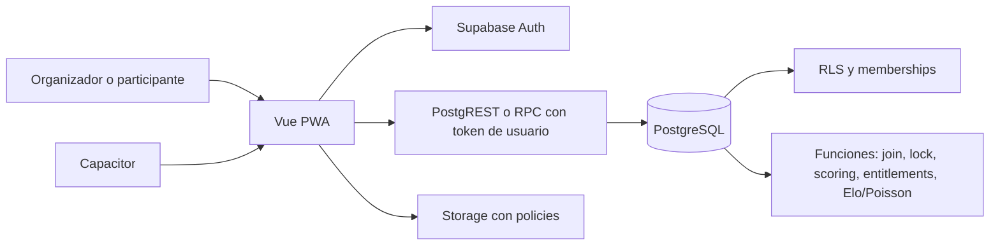
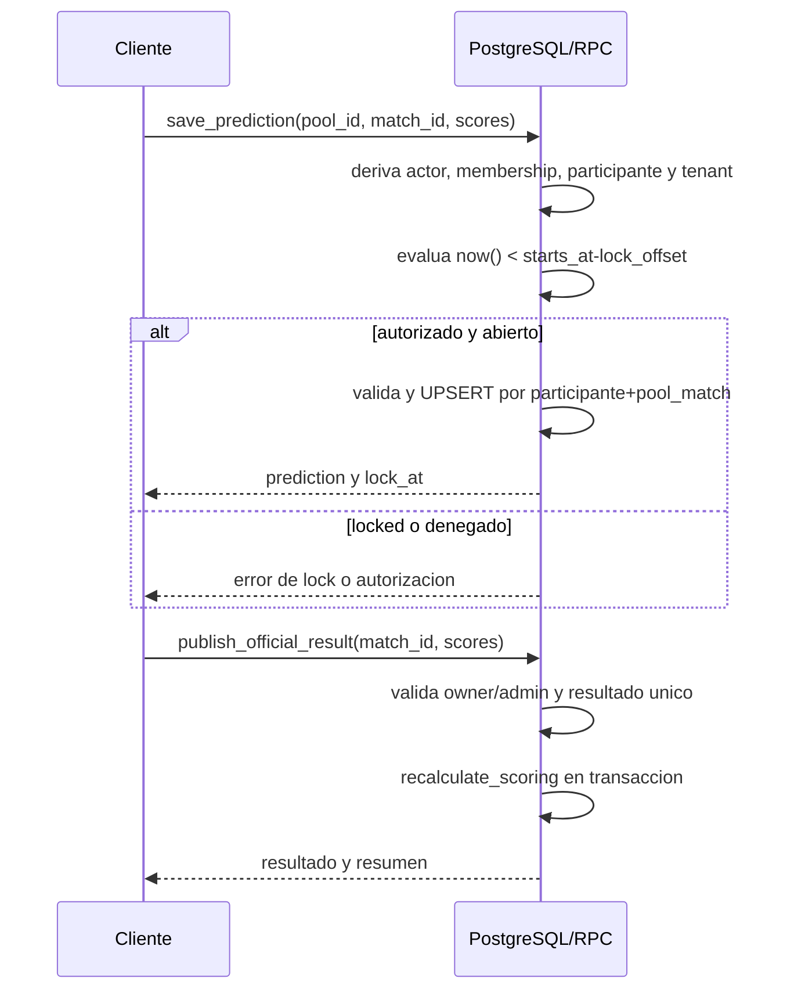
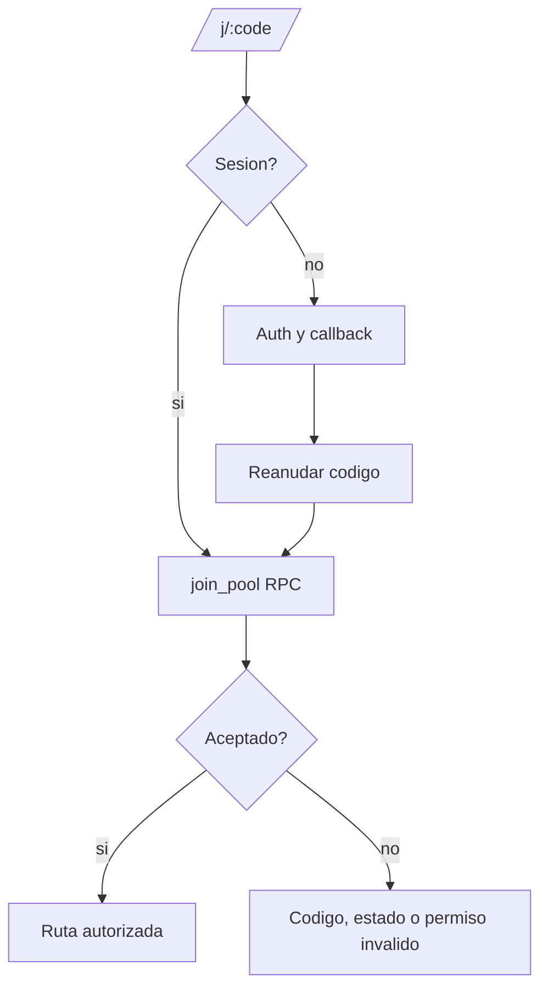

# Contratos de arquitectura - Fase 02

Este documento congela contratos para Fase 03; no define migraciones ni codigo.

## Topologia y limites

| Zona | Responsabilidad | Exclusion |
| --- | --- | --- |
| `apps/platform` | PWA Vue 3/TypeScript: rutas, vistas, composables y adaptadores Supabase. | Autorizar, calcular locks o puntos. |
| `packages/domain` | Tipos, DTOs y reglas puras no autoritativas. | Persistencia, RLS, reloj o acumulacion de puntos. |
| `packages/ui` | Componentes accesibles mobile-first sin acceso a Supabase. | Estado de negocio o permisos. |
| `supabase` | Migraciones, RLS, RPC, Storage policies, seeds y pruebas SQL. | Render de UI o secretos cliente. |
| `mobile` | Capacitor, deep links, share/push adapters y empaquetado. | Duplicar logica de negocio. |

Hay un unico producto web/movil. El cliente usa token de usuario de Supabase y nunca service-role. No se adopta aun dependencia adicional de state/query: Fase 04 puede usar composables Vue y requerira ADR si una dependencia se vuelve necesaria.

## Convenciones y ownership

- PKs de dominio: UUID; `profiles.id` referencia el UUID de Auth.
- `created_at` y `updated_at` son `timestamptz`; todo timestamp se almacena UTC.
- `tenants.timezone` usa zona IANA solo para presentar. Autorizacion y lock usan tiempo DB.
- Roles de membership: `owner`, `admin`, `member`. El estado `paid`, `pending` o `invited` del participante no concede rol.
- Todas las filas tenant-owned incluyen `tenant_id`; Fase 03 impone coherencia con FK/constraints y RLS.

| Entidad/concepto | Ownership | Regla de acceso |
| --- | --- | --- |
| `profiles`, `plans` | Global | Perfil propio; planes de lectura segun RLS. |
| `tenants`, `tenant_memberships`, `tenant_entitlements`, `tenant_branding` | Tenant | `auth.uid()` deriva membership; owner/admin mutan administracion. |
| `pools`, `pool_rules`, `pool_join_codes`, `participants` | Tenant | Membership y, cuando aplique, participacion aprobada. |
| `tournaments`, `rounds`, `teams`, `matches`, `pool_matches`, `official_results` | Tenant | Membership; resultado solo owner/admin. |
| `predictions` | Tenant y participante | Propietario lee/escribe; otros solo despues de revelacion. |
| `scoring_events`, leaderboard derivado | Tenant | Lectura autorizada; escritura SQL exclusivamente. |
| `team_ratings`, `model_predictions` | Tenant | Lectura autorizada; escritura por motor SQL. |
| `branding_assets`, `audit_log` | Tenant | Branding por rol/plan; audit para owner/admin u operacion privilegiada. |

Un join code es opaco, de seis caracteres, habilitable/expirable y solo descubre o solicita union. No otorga rol ni evita RLS.

## Estados, lock y privacidad

| Maquina | Estados y transiciones |
| --- | --- |
| Quiniela | `draft -> open`; `open -> paused -> open`; `draft/open/paused -> archived`; `archived` terminal. |
| Partido | `scheduled -> live -> final`; una correccion actualiza el resultado oficial unico manteniendo `final`. Cancelado/postergado no entra al MVP sin contrato de producto. |
| Pronostico | Estado calculado, no persistido: `open` si `now() < starts_at - lock_offset`; `locked` en caso contrario. `live`/`final` proceden del partido. |

`lock_offset` pertenece al pool. `save_prediction` carga pool y partido en una transaccion, calcula el limite con `now()` de PostgreSQL y rechaza `now() >= lock_at`. Desde `lock_at` inclusive se revelan pronosticos ajenos a participantes autorizados; antes solo se revela el propio. La misma condicion aplica a RLS y/o RPC de lectura; la UI solo la representa.

## Reglas, scoring y leaderboard

Cada pool tiene regla versionada: `exact_points`, `outcome_points`, `tie_breaker` (`exact_predictions` o `prediction_submitted_at`) y coleccion validada de bonos. El PRD no define valores ni tipos de bonos adicionales: Fase 03 solo modela el contrato versionable y Fase 08 habilita exclusivamente bonos aprobados. FREE usa identificador de regla estandar; PRO usa configuracion valida autorizada server-side.

Los inputs fuente son resultado oficial, prediccion y version de regla. `scoring_events` es proyeccion reconstruible con clave unica por prediccion, revision de resultado y regla. `recalculate_scoring` reemplaza en transaccion la proyeccion del alcance; no usa `+=`. Leaderboards general, por jornada y rachas se derivan por view/query inicialmente, sin snapshots. Materializar requiere ADR y reconstruccion desde inputs.

## RPCs y fronteras de autoridad

Los DTOs no incluyen `tenant_id` como evidencia de autorizacion; la funcion deriva tenant y permisos desde `auth.uid()` y registros server-side.

| Operacion | Entrada minima | Invariantes y salida |
| --- | --- | --- |
| `join_pool` | join code o invitacion | Resuelve pool, comprueba codigo/estado y crea o retorna participacion idempotente; devuelve destino autorizado. |
| `save_prediction` | pool, match, scores no negativos | Deriva participante, aplica lock DB, valida y UPSERT unico; devuelve prediction y `lock_at`. |
| `publish_official_result` | match, scores no negativos | Owner/admin; publica/corrige resultado unico y recalcula transaccionalmente. |
| `recalculate_scoring` | alcance `match`, `round` o `pool` | No acepta puntos cliente; reemplaza proyeccion idempotente. Solo admin o llamada interna. |
| `manage_pool` | accion y payload valido | Crea/edita/pausa/archiva; aplica rol y entitlement. |
| `manage_membership` | objetivo, rol/estado permitido | Solo owner/admin segun matriz de roles; separa rol y pago. |
| `manage_schedule` | torneo, jornada, equipos, kickoff o partido | Solo owner/admin; valida tenant y prepara resultados/recalculo. |
| `get_stat_suggestion` | match/pool autorizado | Elo+Poisson reproducible; sugerencia editable, nunca consejo de apuesta. |

RLS protege acceso directo. Mutaciones con invariantes de varias filas, tiempo, roles, limites o recalculo usan RPC SQL. TypeScript comparte DTOs, valida UX y traduce errores; no replica autorizacion, scoring, Elo, Poisson ni lock.

## Entitlements, Storage y deep links

`tenant_entitlements`, asociado a `plans`, es fuente de verdad. Cada mutacion que consume capacidad invoca comprobacion DB/RPC: FREE permite maximo 10 participantes y una quiniela activa, regla estandar, watermark y branding SportLeagues; PRO habilita capacidades documentadas. Fase 03 crea esa frontera aunque Fase 12 complete UX, auditoria y downgrade. No hay checkout ni cobro.

Logos y banners usan bucket Storage privado con ruta `{tenant_id}/{asset_uuid}`, sin depender de extension, y metadata `branding_assets`. Policies y DB validan membership, rol, plan, tipo, tamano y ruta; una Edge Function autenticada inspecciona firma binaria, MIME real y dimensiones antes de activar un asset. SVG queda prohibido hasta contar con sanitizacion segura. El lifecycle, reemplazo, limpieza y downgrade PRO a FREE se rigen por ADR-007. Flyers se generan localmente para descarga/Web Share y no se persisten por defecto.

El join canonico es `/j/:code` en web y Capacitor. Sin sesion, se conserva el codigo solo como intencion local no confiable; tras Auth se llama `join_pool`. Fase 11 fija hosts/esquemas de app/universal links.

