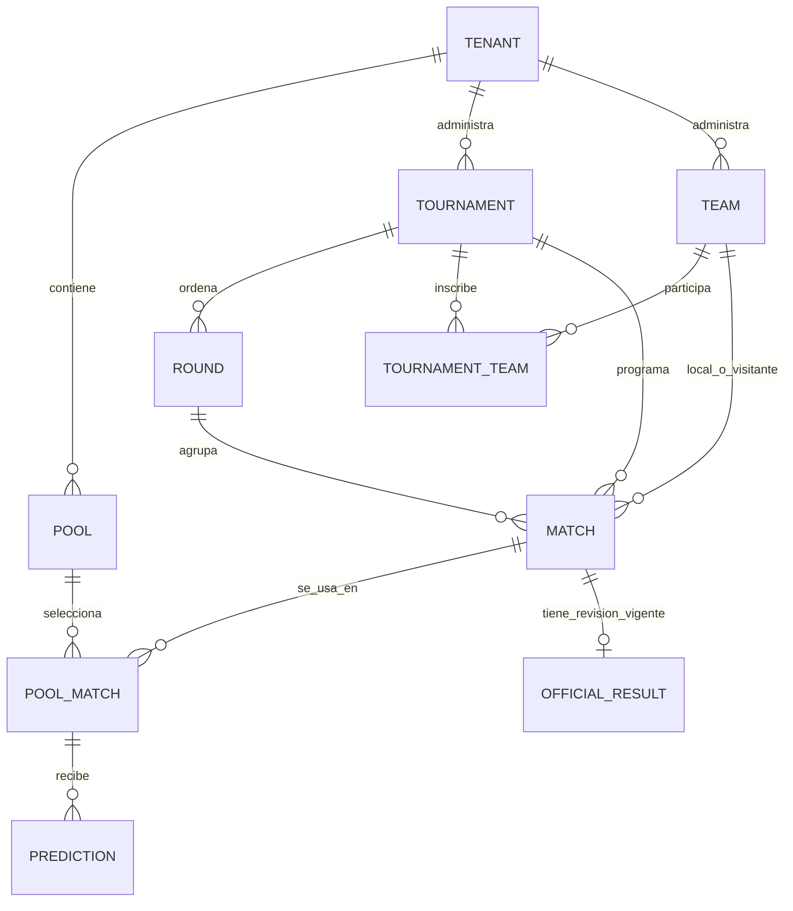

# Fase 06 — preparación arquitectónica (borrador)

> Estado: **propuesta pre-acceptance**. No inicia formalmente la Fase 06, no autoriza una migración
> ni cambia el contrato actualmente aplicado. Las decisiones de este documento solo entran en vigor
> si los ADR-009 a ADR-012 son aceptados y se implementan en una fase autorizada.

## Propósito y límites

Este documento convierte las brechas del contrato visual de Fase 06 en decisiones implementables.
Parte del esquema de Fase 03 ya aplicado, pero no altera `supabase/**`, RLS, RPC, Edge Functions ni
la fuente de datos de la UI. La jerarquía de autoridad sigue siendo: `AGENTS.md`, ADR aceptados,
`PROJECT_CONFIG.md`, PRD y requisitos.

Fuera de alcance: proveedor de datos deportivos, resultados automáticos o en vivo, plantillas de
jugadores, apuestas, pagos y la conexión de la UI a Supabase.

## Modelo de dominio propuesto

| Concepto | Propiedad y propuesta | Invariantes que debe imponer DB/RPC al implementar |
| --- | --- | --- |
| Tenant | Frontera de aislamiento existente. | Ninguna entrada del cliente convierte un `tenant_id` en permiso. |
| Pool / liga | Quiniela de un tenant y unidad de participación. Conserva `lock_offset`. | Un `pool_match` y sus participantes pertenecen al mismo tenant y pool. |
| Torneo | Catálogo deportivo manual de un tenant. Propuesta: `sport_code`, `country_code` opcional, `season_label` opcional y color de presentación validado. | Nombre no es identidad global; sus datos solo son visibles dentro de su tenant autorizado. |
| Equipo | Catálogo reusable del tenant. Propuesta: país opcional, color primario/secundario y referencia a escudo seguro. | `unique (tenant_id, normalized_name)`; no asumir que el mismo nombre identifica al mismo equipo en otro tenant. |
| `tournament_teams` | Nueva relación explícita propuesta. Un equipo puede participar en varios torneos de su tenant; un torneo tiene muchos equipos. | Un partido solo puede usar equipos inscritos en su torneo y del mismo tenant. |
| Jornada | Sigue perteneciendo a un torneo y mantiene orden estable. | Su torneo, los partidos y los equipos deben compartir tenant. |
| Partido | Fixture manual del torneo: jornada, local, visita, `starts_at`, estado. | Local distinto de visita; no cruzar tenant/torneo; cambios tardíos no pueden reabrir pronósticos. |
| `pool_matches` | Selección de los partidos que cuenta para cada liga. | Es el alcance de predicción y lock; el mismo partido puede estar en varios pools con reglas/lock distintos. |
| Resultado oficial | Una fila vigente por partido con `revision` monotónica, publicada únicamente por RPC. | Corrección incrementa revisión y gatilla recálculo transaccional; no hay escritura directa. |
| Pronóstico | Por participante + `pool_match`; no por partido global. | Unicidad existente, participante aprobado, pool abierto y lock calculado en DB. |

La tabla de posiciones deportiva no es el leaderboard de la quiniela. Se deriva de resultados
oficiales de un torneo (propuesta inicial: 3 puntos victoria, 1 empate, 0 derrota; diferencia de
goles, goles a favor y nombre como orden de presentación). No se vende como clasificación oficial
ni reemplaza la regla configurable de puntos de la quiniela. El desempate deportivo final queda
pendiente de producto; hasta entonces el frontend debe etiquetar el último criterio como
"orden de presentación".

## Decisiones propuestas

### Catálogos y activos visuales

- Un equipo pertenece al tenant, no implícitamente a un torneo. `tournament_teams` representa la
  inscripción. Es necesaria para que un equipo pueda competir en más de un torneo sin duplicarlo.
- `sport_code` será un valor controlado por aplicación/DB, inicialmente los deportes ya expuestos
  en la UI (`football`, `basketball`, `tennis`). El alta de otro valor necesita contrato y tests,
  no texto libre. `country_code` usa ISO 3166-1 alpha-2 cuando exista; no se infiere por nombre.
- Los colores se validan como hex opaco (`#RRGGBB`) y sirven solo a presentación. Nombre, color y
  siglas generadas forman una identidad suficiente sin subir archivos.
- Está prohibido cargar o enlazar logos oficiales de clubes, ligas o federaciones sin licencia
  documentada. El valor por defecto es un escudo generado por iniciales y colores propios.
- Si se autoriza una carga, el escudo debe vivir en un bucket privado separado, por ejemplo
  `team-assets`, con ruta canónica `{tenant_uuid}/{asset_uuid}` y metadata tenant-scoped. Solo
  owner/admin inicia, reemplaza o elimina mediante RPC + función server-side; miembros autorizados
  reciben URL firmada corta únicamente para assets activos. PNG/JPEG/WebP se inspeccionan y
  recodifican a WebP; SVG, hotlinks externos, nombre original y URL pública quedan prohibidos.
  El lifecycle debe ser análogo al de ADR-007, sin reutilizar `branding_assets`, pues los
  entitlements, referencias y retención son distintos.

### Contexto activo y alcance de `/partidos`

La pantalla `/partidos` debe mostrar **los `pool_matches` del pool activo**, no todos los partidos
del tenant. Es el único alcance que dice de forma inequívoca qué fixture afecta los pronósticos y
qué `lock_offset` aplica. El detalle de torneo puede mostrar la tabla y fixture de ese torneo solo
si llegó a él desde un `pool_match` visible en el pool activo.

Un usuario con varias memberships selecciona explícitamente `tenant_id` y después `pool_id` en un
selector de contexto. La preferencia puede persistirse localmente por perfil como UX, pero no es
autorización y se invalida si la membership/pool ya no es legible. Si hay varios pools en el tenant,
el usuario escoge uno; no se mezclan en una lista silenciosa. Una futura vista "todos mis pools"
puede agrupar por pool con etiqueta de tenant y nunca fusionar sus pronósticos o locks.

El ID enviado por cliente solo localiza el contexto. La consulta/RPC debe derivar autorización de
`auth.uid()`, membership activa y, cuando aplica, participación aprobada. Los nombres repetidos de
tenant, pool o equipo son válidos: UI los desambigua con el tenant/pool del contexto y los UUID/FK
son la identidad real.

### Cierre de pronósticos

Se reafirma el contrato aceptado de Fase 02 y ADR-005: `lock_offset` pertenece al **pool** y para
cualquier `pool_match` el límite es `matches.starts_at - pools.lock_offset`. El mismo partido
asociado a dos pools puede cerrar en momentos distintos. Fase 06 no introduce override por torneo
ni por partido; hacerlo requeriría ADR nuevo porque alteraría privacidad y reglas de quiniela.

La base calcula y compara con `now()` de PostgreSQL en cada lectura/escritura crítica. El frontend
muestra un `lock_at` calculado/retornado por servidor, formateado en `tenants.timezone`, y trata su
propio contador como orientativo. Después de un rechazo de `save_prediction` actualiza el estado
desde servidor; jamás intenta compensar con el reloj del dispositivo.

La implementación autorizada debe decidir y probar la semántica de cambios administrativos: una
edición de kickoff o `lock_offset` no puede reabrir un `pool_match` cuyo lock ya venció. La propuesta
es rechazar cualquier edición que cambie el límite de un partido ya bloqueado; para los abiertos,
permitirla solo con auditoría. Esta regla se implementaría junto con la RPC que modifica el fixture,
no en la UI.

### Resultados y recálculo

`publish_official_result` es la única vía de alta/corrección. En la misma transacción debe bloquear
el partido y su resultado vigente, validar actor tenant-admin, marcador no negativo y estado
permitido, crear o actualizar el resultado con revisión monotónica, y dejar el partido en `final`.
Una corrección conserva una única fila vigente e incrementa `revision`; la evidencia de antes/después
va a `audit_log`, no a campos de entrada controlados por cliente.

El recálculo se invoca dentro de esa transacción y opera sobre los `pool_matches` del partido. Debe
reemplazar la proyección de `scoring_events` por la clave existente
`(prediction_id, result_revision, rule_version)`, nunca sumar puntos. Repetir exactamente la misma
publicación debe devolver el mismo resultado y no duplicar eventos; una corrección elimina o deja
fuera de la proyección activa las revisiones anteriores conforme a la estrategia de Fase 08. No se
publica una API para que el cliente envíe puntos.

## Propuesta de contratos de RPC (sin implementación)

| RPC | Actor permitido | Reglas propuestas | Respuesta mínima |
| --- | --- | --- | --- |
| `manage_schedule` | `owner`/`admin` activo del tenant resuelto por la entidad. | Comandos explícitos para torneo, equipo, inscripción `tournament_team`, jornada, partido y asociación/quita de `pool_match`; valida tenant, inscripciones, estado y lock. No acepta `tenant_id` como prueba de rol. | Entidad afectada, `operation_id`, `updated_at` y, si afecta fixture, `lock_at` por pool. |
| `publish_official_result` | `owner`/`admin` activo del tenant del partido. | Publica/corrige con `expected_revision` para evitar actualización perdida; bloquea filas, audita y llama al recálculo interno. | Resultado vigente, revisión, alcance recalculado e idempotency/operación. |
| `recalculate_scoring_for_result` | Solo llamada interna desde `publish_official_result` o job privilegiado futuro. | No tiene `GRANT EXECUTE` a `authenticated`/`PUBLIC`; recibe IDs derivados y reemplaza proyección. | Conteos de pronósticos/eventos recalculados para auditoría. |

`superadmin` no obtiene por defecto permiso para gestionar el calendario de un tenant ni publicar
resultados. ADR-008 separa autorización global y tenant-scoped; una futura acción global necesitará
una RPC distinta, autorización `is_platform_admin()` y auditoría explícita. El router y la selección
de contexto solo mejoran UX, nunca conceden estos permisos.

Auditoría mínima por operación administrativa: `tenant_id` derivado, `actor_id`, acción,
tipo/id de entidad, `operation_id`, timestamp DB, revisión previa/nueva cuando corresponda y un
resumen permitido de valores anteriores/nuevos. No guardar JWT, URLs firmadas, archivos binarios ni
datos personales innecesarios.

## Secuencia de implementación cuando sea autorizada

1. Aceptar/rechazar ADR-009 a ADR-012 y cerrar los bloqueos de aceptación de Fase 05/05-bis.
2. Diseñar una migración forward-only con constraints/FK compuestas para catálogo, inscripción de
   equipos, activos y RPC; revisar RLS y tests negativos por tenant/rol antes de aplicar nada.
3. Implementar primero `manage_schedule` y sus pruebas transaccionales, incluyendo cambios de
   kickoff/lock y relaciones cruzadas inválidas.
4. Implementar `publish_official_result` + recálculo interno idempotente y pruebas de primera
   publicación, repetición, corrección, concurrencia y aislamiento.
5. Solo después conectar la fuente de UI y validar con usuarios reales de varios tenants y pools.

## Bloqueos para inicio formal

- Fase 05 y Fase 05-bis no están ACCEPTED: faltan los happy paths HTTP y validación manual
  documentados; QA permanece inaccesible por instrucción.
- Los ADR propuestos requieren aceptación antes de modificar esquema central, autorización, lock o
  recálculo.
- Falta decidir el criterio deportivo oficial de desempate y el alcance exacto de la tabla de
  posiciones (solo presentación MVP frente a ranking reglamentario).
- Falta validar en QA la lectura multi-tenant/pool real bajo RLS y la semántica actual de `pool_matches`.
- Si se permiten archivos de escudo, hace falta confirmar fuente/licencia de los assets propios y
  aprobar el lifecycle/bucket antes de ofrecer carga.
